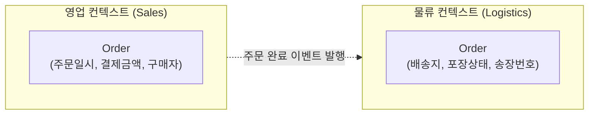
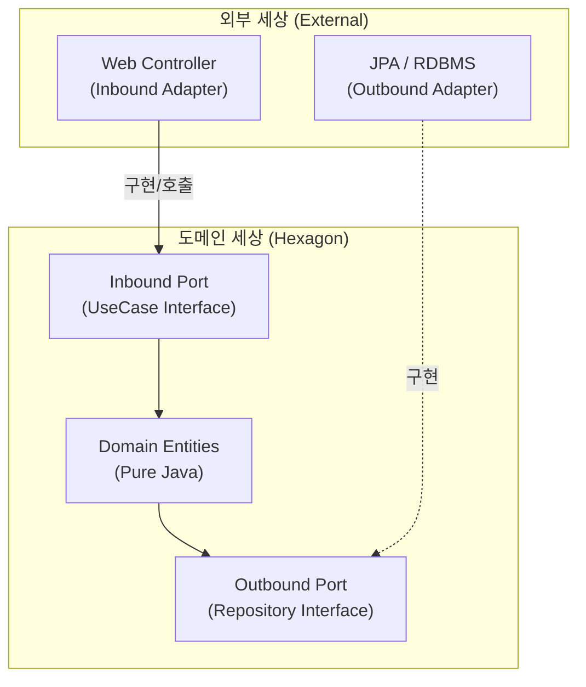
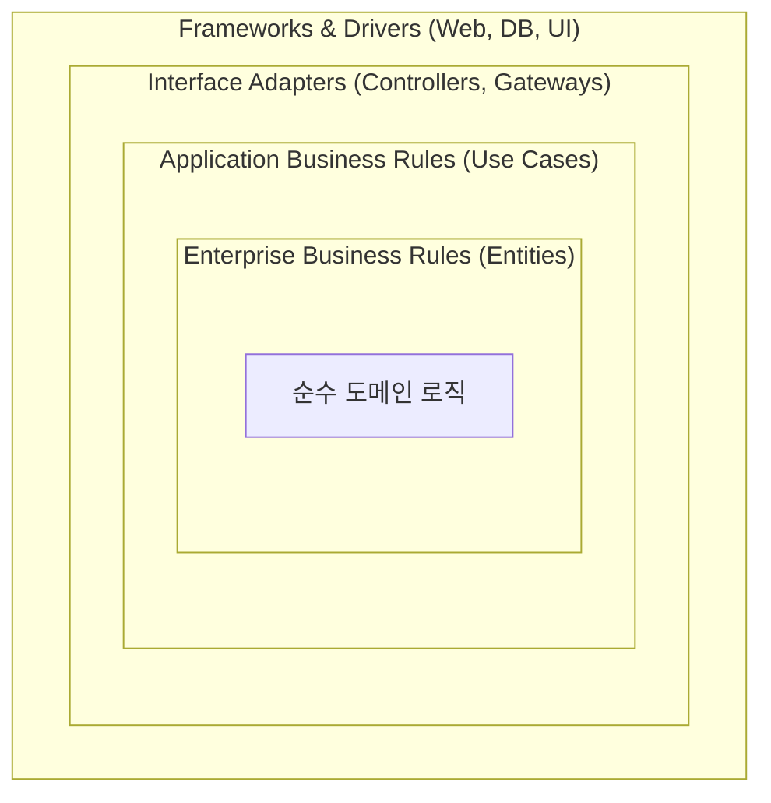

# [설계] 모놀리식 MVC의 한계를 넘어: DDD와 아키텍처(Hexagonal, Clean) 도입기

단일 애플리케이션 안에서 MVC 패턴으로 빠르게 기능을 찍어내던 시기가 지나면, 어느 순간 **'성장통'**이 찾아온다. 하나의 `Order` 클래스에 수십 개의 필드가 추가되고, `OrderService`는 수천 줄이 넘어가며, JPA 엔티티 수정 한 번에 시스템 곳곳에서 에러가 터진다.

비즈니스 로직과 기술(DB, 프레임워크)이 무분별하게 섞여 스파게티가 된 코드를 어떻게 구출할 수 있을까? 이 문제를 해결하기 위한 여정으로 **DDD(도메인 주도 설계)**와 이를 받쳐주는 **헥사고날/클린 아키텍처**에 대해 정리해 본다.

---

## 1. DDD (Domain-Driven Design): 소프트웨어의 심장 찾기

DDD의 핵심 철학은 단순하다. **"기술(DB, 프레임워크)이 아닌, 핵심 비즈니스(도메인)를 중심으로 소프트웨어를 설계하라."**

지금까지 우리는 DB 테이블을 먼저 설계하고, 그에 맞춰 객체를 만들고, 로직을 끼워 맞추는 '데이터 중심 설계'를 해왔을 확률이 높다. 하지만 DDD는 현실 세계의 비즈니스 규칙을 순수한 모델(Entity, VO)로 구현하는 것을 최우선으로 삼는다. 여기서 가장 중요한 첫 번째 행동 지침이 바로 **Bounded Context**다.

---

## 2. Bounded Context: 비즈니스의 논리적 경계 긋기

시스템이 커지면 부서마다 같은 단어를 다른 의미로 사용하기 시작한다. 

* **영업팀의 주문(Order):** 구매자의 정보와 결제 금액이 중요한 '매출의 단위'
* **물류팀의 주문(Order):** 배송지 주소와 포장 규격이 중요한 '출고의 단위'

이걸 하나의 거대한 `Order` 클래스로 묶으면 각 팀의 요구사항이 충돌하며 코드가 꼬인다. **Bounded Context(바운디드 컨텍스트)**는 이 의미의 충돌을 막기 위해 **"이 경계 안에서는 이 단어를 이런 뜻으로만 쓴다"**라고 논리적인 울타리를 치는 것이다.



이렇게 컨텍스트를 나누면 코드의 주인이 명확해지고, 다른 도메인의 눈치를 보지 않고 독립적으로 모델을 발전시킬 수 있다. (MSA로 서비스를 쪼개는 가장 훌륭한 기준점이 되기도 한다.)

---

## 3. Hexagonal Architecture: 도메인을 지키는 물리적 방패

Bounded Context로 도메인의 논리적 경계를 나눴다면, 이제 이 순수한 도메인을 외부 기술(JPA, 웹 프레임워크)의 오염으로부터 지켜낼 '물리적 구조'가 필요하다. 여기서 **헥사고날 아키텍처(Ports & Adapters)**가 등장한다.

핵심은 **의존성의 방향을 역전**시켜, 도메인이 기술을 아는 것이 아니라 기술이 도메인에 맞춰(Adapter) 연결(Port)되게 하는 것이다.



### 💻 코드 예시 (Java / Spring)
서비스 코드가 JPA에 묶여있는 기존 방식과 달리, 인터페이스(Port)를 두어 격리한다.

**1. Outbound Port (도메인 계층의 요구사항)**
```java
// 도메인 계층 (순수 Java)
public interface OrderRepositoryPort {
    void save(Order order); // JPA Repository가 아님!
}
```

**2. Application Service (유스케이스)**
```java
@Service
@RequiredArgsConstructor
public class PlaceOrderService implements PlaceOrderUseCase { // Inbound Port 구현
    private final OrderRepositoryPort orderRepository; // 인터페이스에만 의존

    @Override
    public void placeOrder(Command command) {
        Order order = Order.create(command); // 순수 도메인 비즈니스 수행
        orderRepository.save(order); // DB 기술은 모른 채 포트에 던짐
    }
}
```

**3. Outbound Adapter (인프라 계층)**
```java
@Component
@RequiredArgsConstructor
public class JpaOrderRepositoryAdapter implements OrderRepositoryPort {
    private final JpaOrderRepository jpaRepository; // 실제 Spring Data JPA

    @Override
    public void save(Order order) {
        // 도메인 엔티티를 JPA 엔티티로 변환(매핑)하여 저장
        OrderEntity entity = OrderMapper.toJpaEntity(order);
        jpaRepository.save(entity);
    }
}
```
DB를 MySQL에서 MongoDB로 바꾸고 싶다면? 도메인이나 서비스 코드는 **단 한 줄도 건드리지 않고** `MongoOrderRepositoryAdapter`만 새로 짜서 끼워 넣으면 된다. (OCP 원칙 달성)

---

## 4. Clean Architecture: 변하는 것과 변하지 않는 것

헥사고날이 포트와 어댑터라는 '연결 방식'에 집중했다면, 로버트 C. 마틴의 **클린 아키텍처(Clean Architecture)**는 이를 '동심원 계층(Layers)'으로 명확히 규정한다.

핵심 원칙은 단 하나, **"의존성 화살표는 무조건 바깥 껍질에서 안쪽 껍질로만 향해야 한다."**



* **Entities (가장 안쪽):** 프레임워크 종속성이 전혀 없는 순수한 비즈니스 규칙의 집약체. (주의: JPA의 `@Entity`가 절대 아니다!)
* **Use Cases:** 도메인 객체를 지휘하여 애플리케이션의 특정 시나리오를 수행하는 계층.
* **Interface Adapters:** 안쪽 계층이 이해할 수 있는 포맷과, 바깥쪽 계층(DB, Web)이 이해할 수 있는 포맷 간의 **데이터 변환(매핑)**을 담당.

클린 아키텍처를 도입하면 필연적으로 각 계층 간 데이터를 전달할 때 DTO 변환이나 도메인 객체 <-> JPA 엔티티 변환과 같은 '보일러플레이트 코드'가 늘어난다. 하지만 이는 도메인을 완벽하게 보호하기 위해 기꺼이 지불해야 하는 **안전 보장 비용(Insurance)**이다.

---

## 마무리하며: 결국은 트레이드오프

DDD, 헥사고날, 클린 아키텍처는 만능 은통알이 아니다. 초기 설계 비용이 높고, 클래스 파일과 매핑 코드가 기하급수적으로 늘어난다. 단순한 CRUD 게시판에 이 아키텍처를 적용하는 것은 닭 잡는 데 소 잡는 칼을 쓰는 격이다.

하지만 비즈니스의 생명 주기가 길고, 도메인 로직이 고도로 복잡해지는 시스템이라면 이야기가 다르다. 
**"비즈니스는 DDD(전략)로 쪼개고 분석하며, 코드는 헥사고날/클린 아키텍처(전술)로 조립하여 도메인을 보호한다."** 이 거대한 객체지향의 원리를 실무에 적용해 나간다면, 코드의 변경이 더 이상 두렵지 않은 견고한 백엔드 시스템을 구축할 수 있을 것이다.